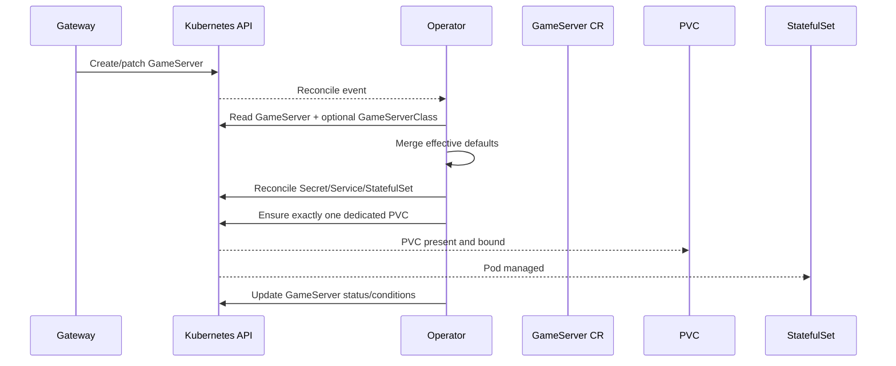

# Architecture

## Scope

In scope:
- `ptero-wings-operator` (Kubebuilder/controller-runtime)
- `ptero-wings-gateway` (HTTP/WebSocket service)
- Kubernetes resources (CRDs, StatefulSets, Services, PVCs, Secrets, Ingress)

Out of scope:
- External clients and panels (modeled only as HTTP/WS callers)

## High-level diagram

```mermaid
flowchart LR
    Client[External HTTP/WS Client\n(e.g. Pterodactyl Panel)] -->|HTTP/WS| Gateway[ptero-wings-gateway]
    Gateway -->|Kubernetes API| K8s[(Kubernetes Cluster)]

    subgraph Cluster[Cluster internals]
      GS[GameServer CR]
      Op[ptero-wings-operator]
      PVC[Dedicated PVC per GameServer]
      SVC[Service]
      STS[StatefulSet]
      Pod[GameServer Pod]

      GS --> Op
      Op --> PVC
      Op --> SVC
      Op --> STS
      STS --> Pod
    end
```

## Reconciliation flow



## Storage model

- Each `GameServer` gets exactly one dedicated PVC named `<gameserver-name>-data`.
- PVC size is resolved in this order:
  1. `GameServer.spec.storage.size`
  2. `GameServerClass.spec.defaultStorage.size`
  3. fallback `1Gi`
- `storageClassName` is optional and can be set directly in `GameServer.spec.storage.storageClassName` or inherited from class defaults.
- Stale PVCs with the same GameServer label are removed during reconciliation, keeping a single managed PVC.

## Gateway integration

- Gateway provides Wings-like `/api` HTTP and WebSocket endpoints.
- Gateway authenticates bearer tokens and performs Kubernetes API operations.
- Ingress terminates TLS and forwards HTTP+WebSocket traffic to `ptero-wings-gateway`.
