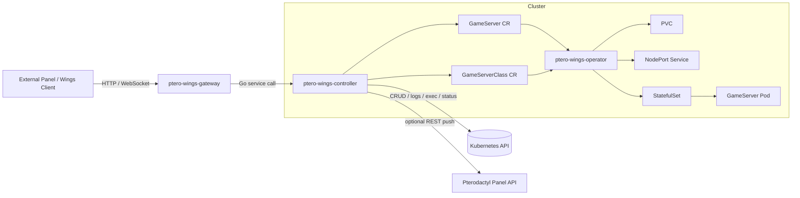
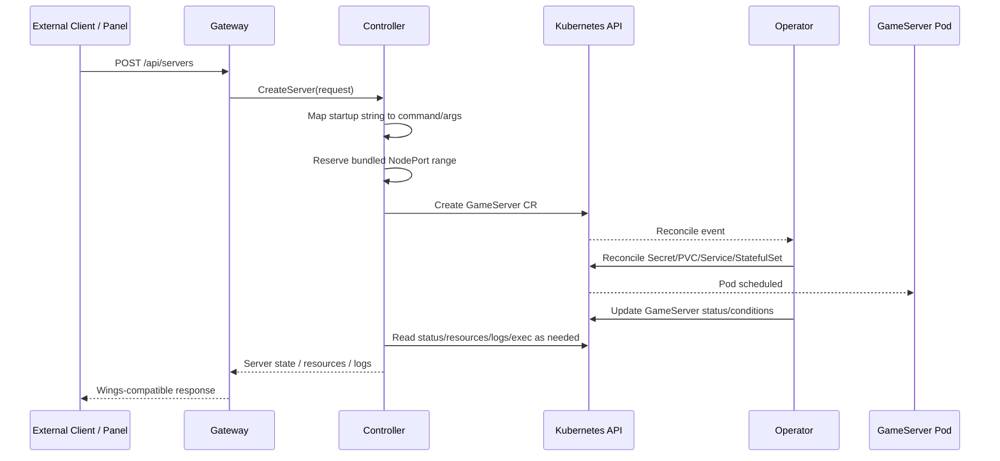

# Architecture

## High-Level Layers



## Request Sequence



## Responsibilities

### ptero-wings-gateway
- Authenticates bearer token or JWT requests
- Exposes Wings-like HTTP and WebSocket endpoints
- Translates request/response payloads at the API boundary
- Delegates business logic to the controller layer

### ptero-wings-controller
- Owns request orchestration and all direct Kubernetes write operations
- Builds `GameServer` specs from external requests
- Converts startup strings into container `command` and `args`
- Allocates contiguous NodePort ranges
- Collects server and cluster metrics
- Optionally pushes metrics to a configured Panel REST API
- Resolves pod logs and exec sessions for console traffic

### ptero-wings-operator
- Watches `GameServer` and `GameServerClass`
- Merges defaults and keeps reconciliation idempotent
- Owns finalizers, conditions, and status updates
- Renders `Secret`, `PVC`, `Service`, and `StatefulSet`

## Startup Mapping

Panel-style startup strings are stored in `spec.runtime.startup.raw` together with replacement variables. The controller resolves templates such as:

- `java -Xmx{{SERVER_MEMORY}}M -jar {{SERVER_JARFILE}}`

into Kubernetes-native fields:

- `spec.game.command: ["java"]`
- `spec.game.args: ["-Xmx1024M", "-jar", "server.jar"]`

This keeps shell parsing isolated in a dedicated mapping layer instead of routing every startup through `sh -c`.

## Bundled NodePort Allocation

`spec.network.nodePortAllocation` enables grouped reservations.

Example:

```yaml
network:
  serviceType: NodePort
  nodePortAllocation:
    startPort: 30005
    count: 5
    containerStartPort: 25565
```

The allocator treats `count` as an inclusive range width after `startPort`, so `30005` + `count: 5` reserves `30005-30010`. If `startPort` is omitted, the controller finds the next free contiguous range inside the configured `NODEPORT_MIN` / `NODEPORT_MAX` interval.

## Metrics Flow

The controller exposes a Wings-aligned resource view:

- `cpu_absolute`
- `memory_bytes`
- `disk_bytes`
- `network_rx_bytes`
- `network_tx_bytes`
- `uptime_seconds`

It also attaches optional cluster totals (node count, pod count, CPU capacity, memory capacity) and can POST those values to a panel endpoint when `PANEL_URL` and `PANEL_TOKEN` are configured.
