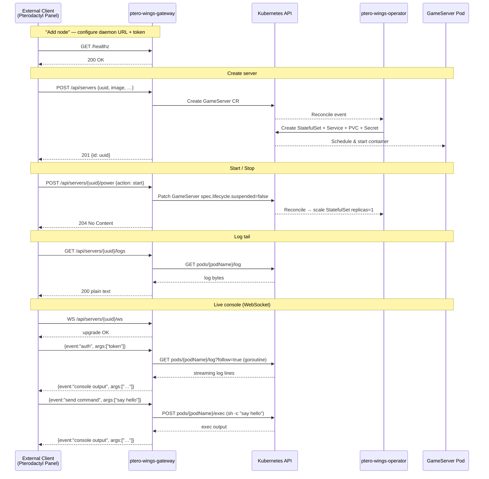

# ptero-wings-operator

A Kubernetes-native replacement for the **Pterodactyl Wings daemon**, consisting of two cooperating components:

| Component | Role |
|---|---|
| **ptero-wings-operator** | Kubernetes operator — reconciles `GameServer` CRDs into Pods, Services, PVCs, Secrets |
| **ptero-wings-gateway** | HTTP/WebSocket API gateway — emulates the Wings daemon API for external clients |

External systems (e.g. a Pterodactyl panel) configure the gateway as a Wings node. They never speak directly to Kubernetes.

---

## Architecture

Detailed architecture and reconciliation notes are available in
[`ARCHITECTURE.md`](./ARCHITECTURE.md).

```
┌────────────────────────────────────────────────────────────────┐
│                   EXTERNAL (out of scope)                       │
│                                                                 │
│   Pterodactyl Panel  ──── HTTP/WS ──────────────────────────►  │
│   (or any Wings client)         ptero-wings-gateway            │
└────────────────────────────────────┬───────────────────────────┘
                                     │  Kubernetes API (HTTPS)
                          ┌──────────▼──────────────────────────┐
                          │         Kubernetes Cluster           │
                          │                                      │
                          │   ┌──────────────────────────────┐  │
                          │   │    GameServer CR (CRD)        │  │
                          │   └────────────┬─────────────────┘  │
                          │                │ watches             │
                          │   ┌────────────▼─────────────────┐  │
                          │   │   ptero-wings-operator        │  │
                          │   │   (controller-runtime)        │  │
                          │   └────────────┬─────────────────┘  │
                          │                │ owns                │
                          │    ┌───────────┼──────────────┐     │
                          │    ▼           ▼              ▼     │
                          │  StatefulSet  Service        PVC    │
                          │       │                             │
                          │    ┌──▼──┐                         │
                          │    │ Pod │ ← game server container  │
                          │    └─────┘                         │
                          └──────────────────────────────────────┘
```

### Communication flow (Mermaid)



---

## Components

### ptero-wings-operator

Watches `GameServer` CRDs and reconciles them into Kubernetes resources.

**Reconcile flow:**
1. Load `GameServer` → ensure finalizer
2. Load optional `GameServerClass` and merge defaults
3. Validate effective spec
4. Allocate ports via `Allocator`
5. Reconcile `Secret`, `PVC`, `Service`, `StatefulSet` (idempotent)
6. Sync status: phase, conditions, endpoint, podName, serviceName

**Status phases:** `Pending → Provisioning → Starting → Running → Stopping → Failed | Suspended`

**Conditions:** `Ready`, `Reconciling`, `Stalled`, `StorageReady`, `NetworkReady`, `PterodactylSynced`

### ptero-wings-gateway

Exposes a Wings-compatible HTTP/WebSocket API. All routes under `/api/` require a `Bearer` token.

| Method | Path | Description |
|---|---|---|
| `POST` | `/api/servers` | Create → GameServer CR |
| `GET` | `/api/servers/{uuid}` | Get phase + endpoint |
| `DELETE` | `/api/servers/{uuid}` | Delete → GameServer CR |
| `POST` | `/api/servers/{uuid}/power` | start / stop / restart / kill |
| `GET` | `/api/servers/{uuid}/resources` | CPU + memory stats |
| `GET` | `/api/servers/{uuid}/logs` | Last N log lines |
| `WS` | `/api/servers/{uuid}/ws` | Live console (log stream + command input) |
| `GET` | `/healthz` | Liveness probe (unauthenticated) |

---

## Quick Start

### Prerequisites

* Kubernetes 1.25+
* `kubectl` configured to point at your cluster
* `make`, `go 1.21+`

### Install the CRD and run the operator locally

```bash
# Install CRDs
make install

# Run the operator (watches all namespaces)
make run
```

### Deploy a Minecraft server

```bash
kubectl apply -f config/samples/gameserver_v1alpha1_gameserver.yaml
kubectl get gameservers
# NAME                PHASE     NODE     ENDPOINT         AGE
# minecraft-survival  Running   node-1   192.168.1.5:25565  30s
```

### Run the gateway locally

```bash
export GATEWAY_TOKEN="my-secret-token"
export GAMESERVER_NS="game-servers"
go run ./gateway/cmd/main.go --addr :8090
```

### Deploy the gateway to Kubernetes

```bash
# 1. Create the token secret
kubectl create secret generic ptero-wings-gateway-token \
  --from-literal=token="<your-secret-token>" -n ptero-system

# 2. Provide a TLS certificate (or use cert-manager)
kubectl create secret tls ptero-wings-gateway-tls \
  --cert=path/to/tls.crt --key=path/to/tls.key -n ptero-system

# 3. Apply RBAC, Deployment, Service, Ingress
kubectl apply -f config/gateway/rbac.yaml
kubectl apply -f config/gateway/deployment.yaml
kubectl apply -f config/gateway/service.yaml
kubectl apply -f config/gateway/ingress.yaml
```

### Configure an external client (e.g. Pterodactyl Panel)

When adding a Wings node to an external panel:

| Field | Value |
|---|---|
| **FQDN / Daemon URL** | `https://wings-gateway.example.com` |
| **Port** | `443` (HTTPS via Ingress) |
| **Daemon Token** | value of `GATEWAY_TOKEN` secret |

The panel will call the gateway's `/api/` endpoints as if it were a real Wings daemon.

---

## GameServer Spec Reference

| Field | Type | Default | Description |
|---|---|---|---|
| `game.type` | string | **required** | Short game identifier, e.g. `minecraft` |
| `game.image` | string | **required** | OCI container image |
| `game.command` | list | | Container entrypoint override |
| `game.env` | list | | Environment variables |
| `runtime.imagePullPolicy` | string | `IfNotPresent` | `Always`, `Never`, or `IfNotPresent` |
| `resources` | object | | CPU / memory requests & limits |
| `storage.size` | quantity | `1Gi` | PVC size |
| `storage.mountPath` | string | `/data` | Mount point inside container |
| `network.serviceType` | string | `NodePort` | `ClusterIP`, `NodePort`, or `LoadBalancer` |
| `network.ports` | list | | Ports to expose |
| `lifecycle.suspended` | bool | `false` | Scale to 0 without deleting |
| `lifecycle.deletePolicy` | string | `Delete` | `Delete` or `Retain` PVCs on deletion |
| `classRef.name` | string | | Reference to a `GameServerClass` for defaults |

> `storage.existingClaim` is deprecated and rejected by validation.  
> The operator always manages one dedicated PVC per `GameServer`.

## GameServer Status

| Field | Description |
|---|---|
| `phase` | `Pending` / `Provisioning` / `Starting` / `Running` / `Stopping` / `Failed` / `Suspended` |
| `conditions` | Standard k8s conditions: `Ready`, `Reconciling`, `Stalled`, `StorageReady`, `NetworkReady`, `PterodactylSynced` |
| `endpoint` | `host:port` the server is reachable on |
| `podName` | Name of the current game server pod |
| `serviceName` | Name of the managed Service |
| `allocatedNode` | Kubernetes node running the pod |
| `lastError` | Most recent reconcile error (cleared on success) |

---

## Development

```bash
# Run tests (requires kubebuilder envtest binaries)
make test

# Regenerate deepcopy / CRD manifests after changing types
make generate manifests

# Build the operator binary
make build

# Build the gateway binary
go build -o bin/gateway ./gateway/cmd/

# Build and push the operator container image
make docker-build docker-push IMG=<registry>/ptero-wings-operator:tag
```

## Code Structure

```
ptero-wings-operator/
├── api/v1alpha1/
│   ├── gameserver_types.go        # GameServer CRD types
│   ├── gameserverclass_types.go   # GameServerClass CRD types
│   └── zz_generated.deepcopy.go
├── controllers/
│   ├── gameserver_controller.go   # Main reconcile loop
│   ├── gameserver_finalize.go     # Finalizer / cleanup
│   ├── gameserver_resources.go    # Child resource reconciliation
│   ├── gameserver_status.go       # Status sync
│   └── helpers/                   # Naming, labels, conditions, defaults
├── internal/
│   ├── ports/                     # Port allocator interface
│   ├── renderer/                  # Pure renderers: Secret, PVC, Service, StatefulSet
│   └── validation/                # Spec validation
├── cmd/main.go                    # Operator entry point
│
├── gateway/                       # ptero-wings-gateway component
│   ├── cmd/main.go                # Gateway entry point
│   └── internal/
│       ├── api/
│       │   ├── router.go          # HTTP router wiring
│       │   └── handlers/
│       │       ├── common.go      # Shared helpers
│       │       ├── servers.go     # POST/GET/DELETE /api/servers
│       │       ├── power.go       # POST /api/servers/{uuid}/power
│       │       ├── resources.go   # GET /api/servers/{uuid}/resources
│       │       ├── logs.go        # GET /api/servers/{uuid}/logs
│       │       └── console.go     # WS /api/servers/{uuid}/ws
│       ├── auth/
│       │   └── middleware.go      # ****** + JWT HS256 auth
│       ├── k8s/
│       │   └── client.go          # K8s client + GameServer CRD helpers
│       ├── logs/
│       │   └── reader.go          # Pod log tail + follow stream
│       └── console/
│           └── exec.go            # Pod exec via SPDY
│
└── config/
    ├── crd/                       # CRD manifests
    ├── rbac/                      # Operator RBAC
    ├── manager/                   # Operator Deployment
    ├── samples/                   # Example GameServer + GameServerClass
    └── gateway/                   # Gateway Deployment + Service + Ingress + RBAC
```

## Examples

Example manifests are available under [`examples/`](./examples):

- `examples/gameserverclass.yaml`
- `examples/gameserver.yaml`
- `examples/gateway/` (RBAC, Deployment, Service, Ingress)
